# Highlights

## January 2025

If you have any plots you would like to see featured on this page or present during a highlights session please post a message to the [#sprint-highlights](https://canariworkspace.slack.com/archives/C06N0TGESJD/p1737646626614279) channel!  We'll then add them here at the end of the day.
 slack channel.

Updates begin January 27, 2025!

Have a great plot from your analysis today? Drop it into the Slack [#sprint-highlights](https://canariworkspace.slack.com/archives/C06N0TGESJD/p1737646626614279) channel!  We'll then add them here at the end of the day.

**Day 1**

Jon got off to a running start with a figure of Subpolar North Atlantic SST changes relative to 1950-1979.

Harry has also plotted the AMOC on z and sigma for 2015 for ensemble member 1:

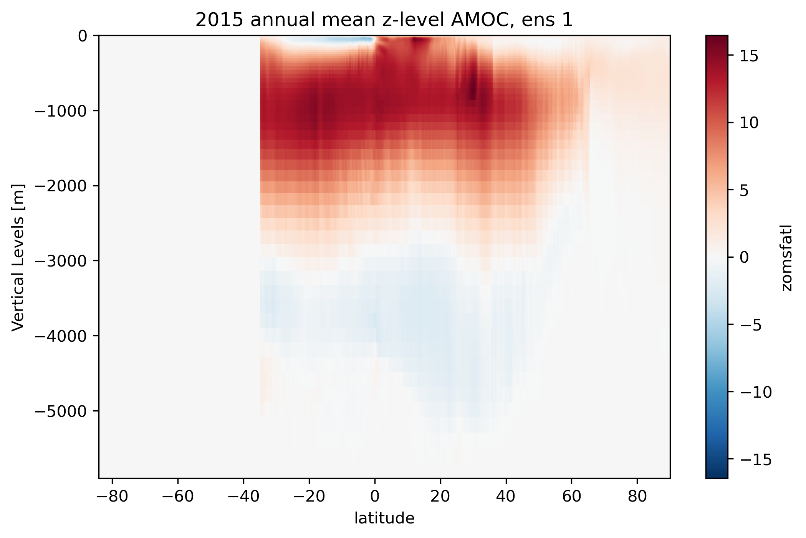 

**Day 2**

Jake has produced a couple of sea ice plots. Time series of September extent 1950–2099 and year of first ("practically") seasonally ice-free Arctic in comparison to CMIP6 models. The LE is on the pessimistic end of CMIP6 projections for the Arctic under SSP3-7.0.**

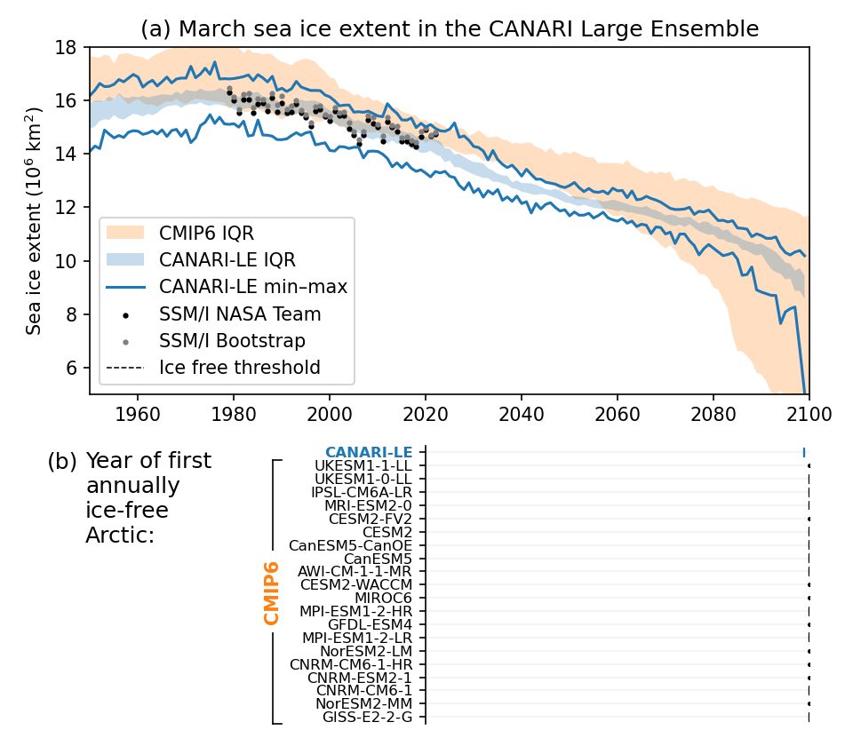
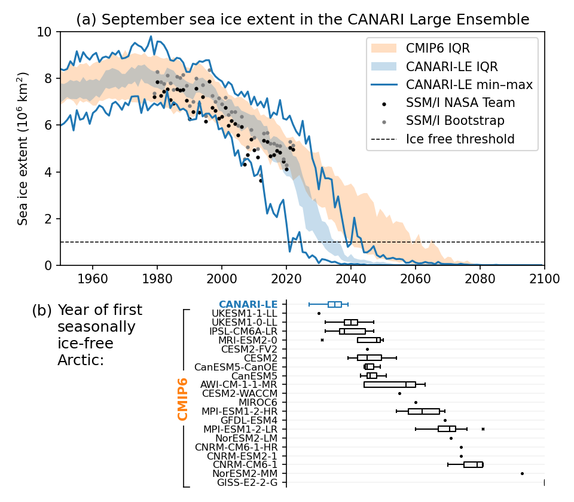

Ollie has calculated the RAPID 26.5N diagnostics using an updated version of the METRIC Python package (https://github.com/oj-tooth/metric/) originally developed at NCAR for all 40 ensemble members from 1950 (HIST2) to 2099 (SSP37). These show the observational-equivalent (using RAPID array methods) MOCz and MHT ensemble mean and spread time series. 

Dan has computed the Atlantic Merional Heat transport at 45N - which is consistent with what Ollie's found with the  MHT at 26.5N 

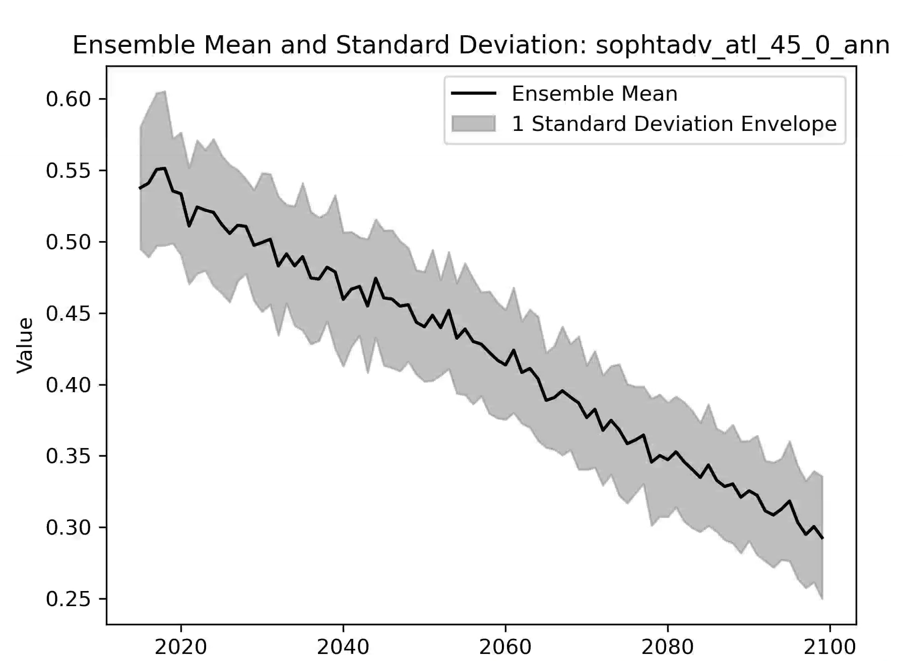

Which is consistent with the AMOC decline on density levels at 45N from Niamh

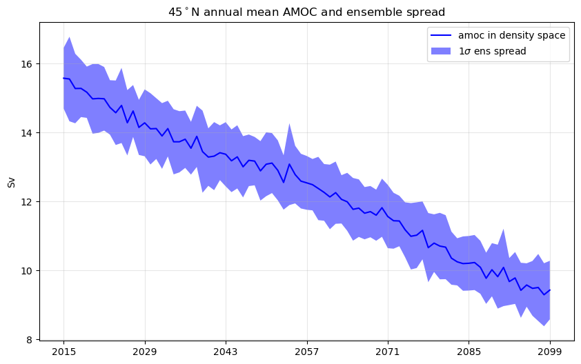

Ben has calculated the Summer jet latitude, focussed on UK longitudes and smoothed with a 15 year running mean.

And the Winter jet speed, also focussed on UK and smoothed with a 15 year running mean.
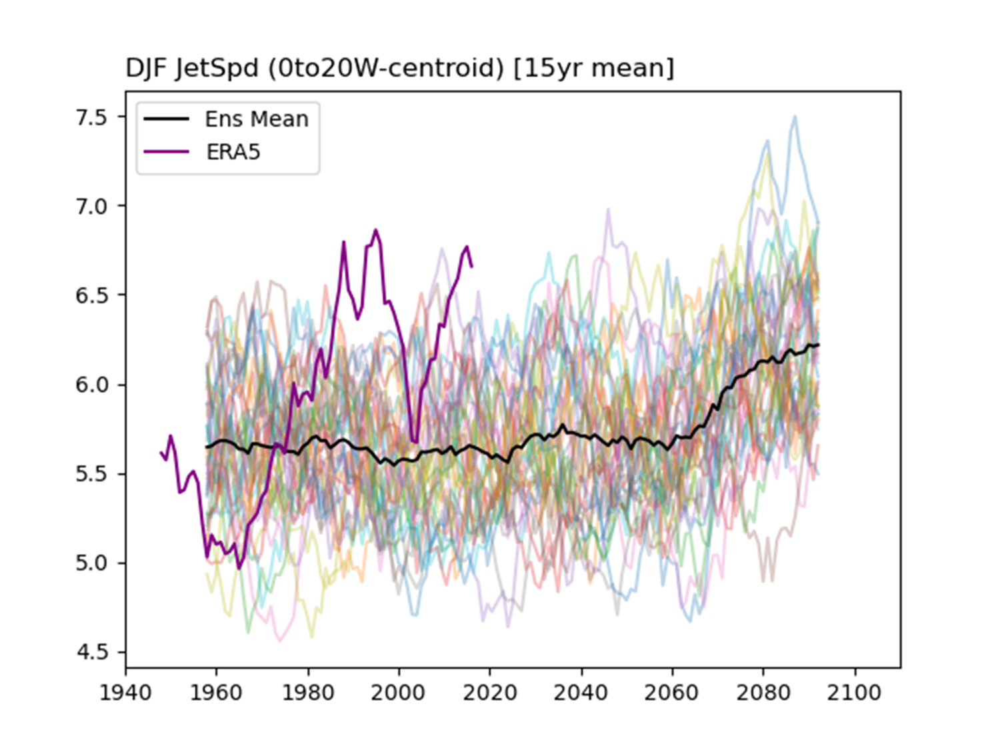

**Day 3**

Holly has been looking at the Subpolar Gyre and the seasonality of the SST.
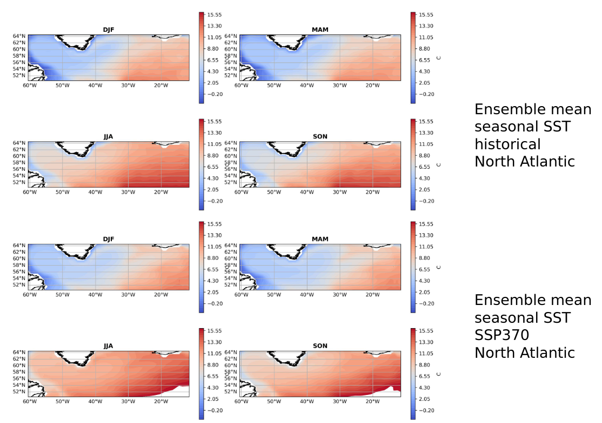
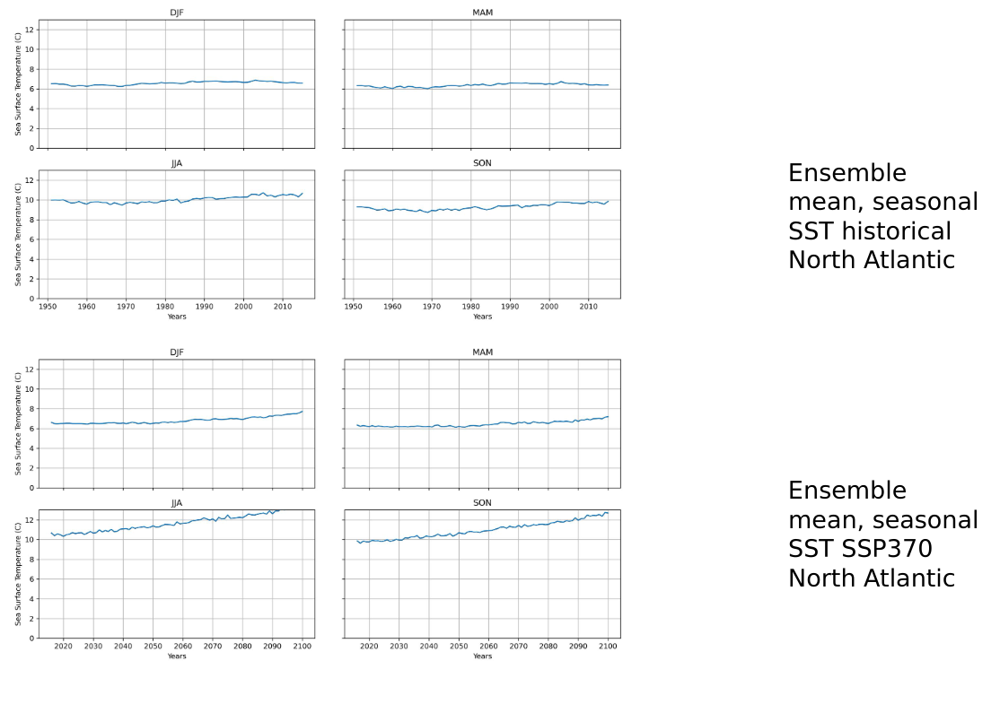

James has produced a nice interactive plot for an SPG index - click on the image to try it out!

Claire has been comparing the model and obs over the Subpolar Gyre (top) and the Cold Air Outbreak region (bottom):

## March 2024

**Day 5**

Motivated by Bablu's time series of heat fluxes over the sub polar gyre (SPG), Simon has been looking at the difference in air-sea heat from between the post-2000 period and 1970-89.  The key features are the weakening of heat loss (red colors) in the SPG which is potentially linked to the weakening of the AMOC found by Adam and Niamh. Process chain would be : weaker AMOC beings less warm water northwards, reduces SST and thus surface heat loss.  And secondly the increase in heat loss in the Arctic (blue) which is presumably related to sea ice decline exposing more of the ocean surface and thus enabling greater heat loss to the atmosphere.

**Day 4**

Amulya showed results which investigated the response of precipitation to changes in the jet at the end of day highlights meeting.  Here is a figure of the relationship between the JJA jet latitude (left) and the DJF jet speed and precipitation over the UK.

Wilson has been looking at precipitation of the UK, which he nicely showed at the end of day highlights meeting.  Here is his time series of the Standardised Precipitation Index (SPI) accumulated over 3 months (SPI-3)UK average compared with SPI calculated from observations (HadUK-Grid).

Paul has been busy looking at precipitation in the CANARI-LE and putting it into perspective with other LE.  The figures below show the MJJAS (NDJFM) precipitation for the Northern (Southern) hemisphere (see the #sprint-highlights Slack channel for more figures).

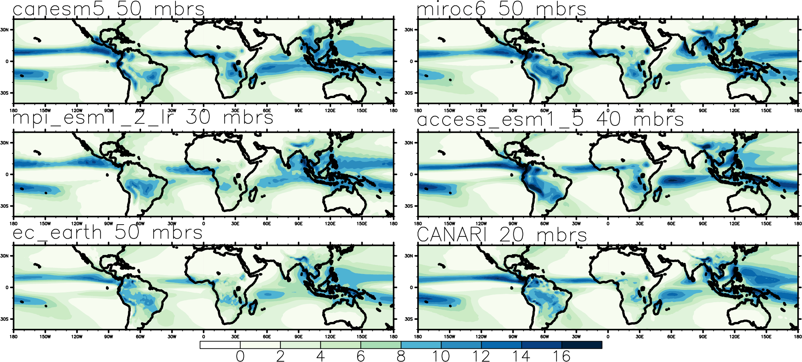

Laura has been looking at the relationship between the winter (DJF) NAO/EAP and 2 m temperature and precipitation.  The figure below shows the results for 2 m temperature (see the #sprint-highlights Slack channel for more figures).

**Day 3**

First results from Claire investigating sea surface temperature in cold air outbreak regions.

More AMOC plots from Niamh, this time in depth space at 40N.

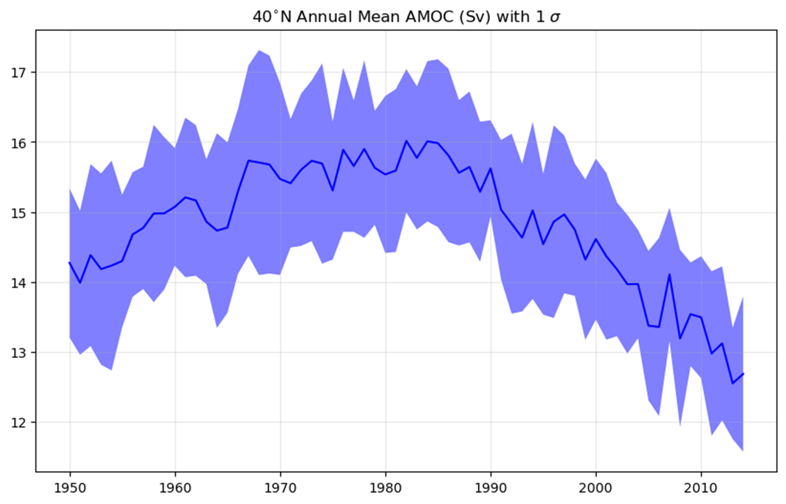

Here are some Adam's plots of annual mean AMOC index at 26N and 1 km depth.

Now available, thanks to Adam, AMOC in depth and density space (/gws/nopw/j04/canari/shared/large-ensemble/derived/HIST2/_ensemble num_/OCN/yearly/_year_/).

First results from Lizzie, composite of DJF sea level pressure for strong - weak polar vortex.

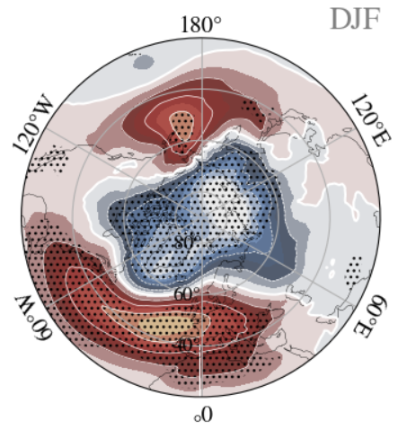

**Day 2**

First results from Bablu, the surface ocean heat flux in the sub-polar gyre for all ensemble members.

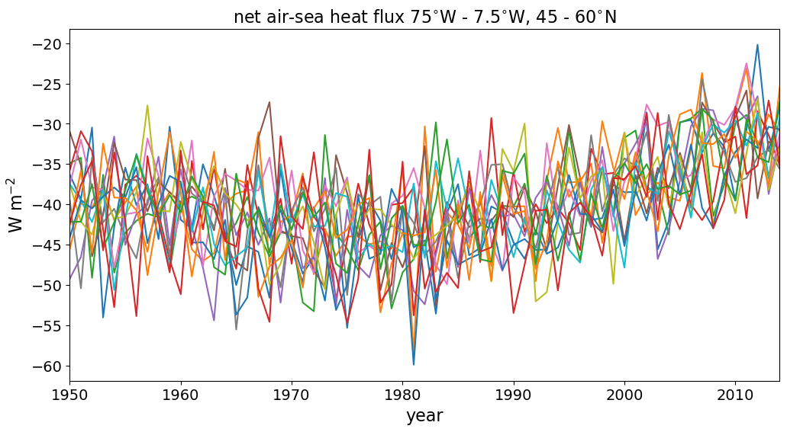

First results from Tony who is looking sudden stratospheric warming, the figure takes a look at the annual cycle of 10hPa U in ensemble member 1.  Years with suspected SSW are highlighted in colour, others are in grey.

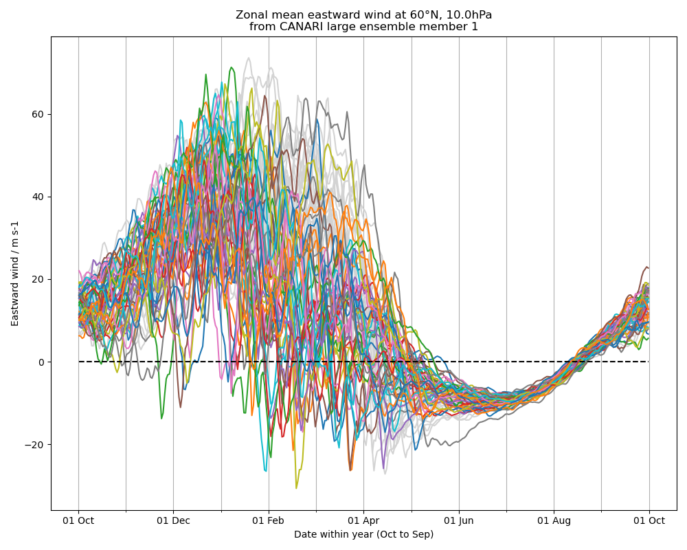

**Day 1**

First results from Dan, the mean sub-polar gyre (50:65N, 0:60W) SST and upper 500 m potential temperature.  With shading showing +/- 1 standard deviation.

[The sprint has begun!](https://canari.ac.uk/2024/03/04/canari-scientists-begin-analysis-of-the-hadgem3-large-ensemble/)
