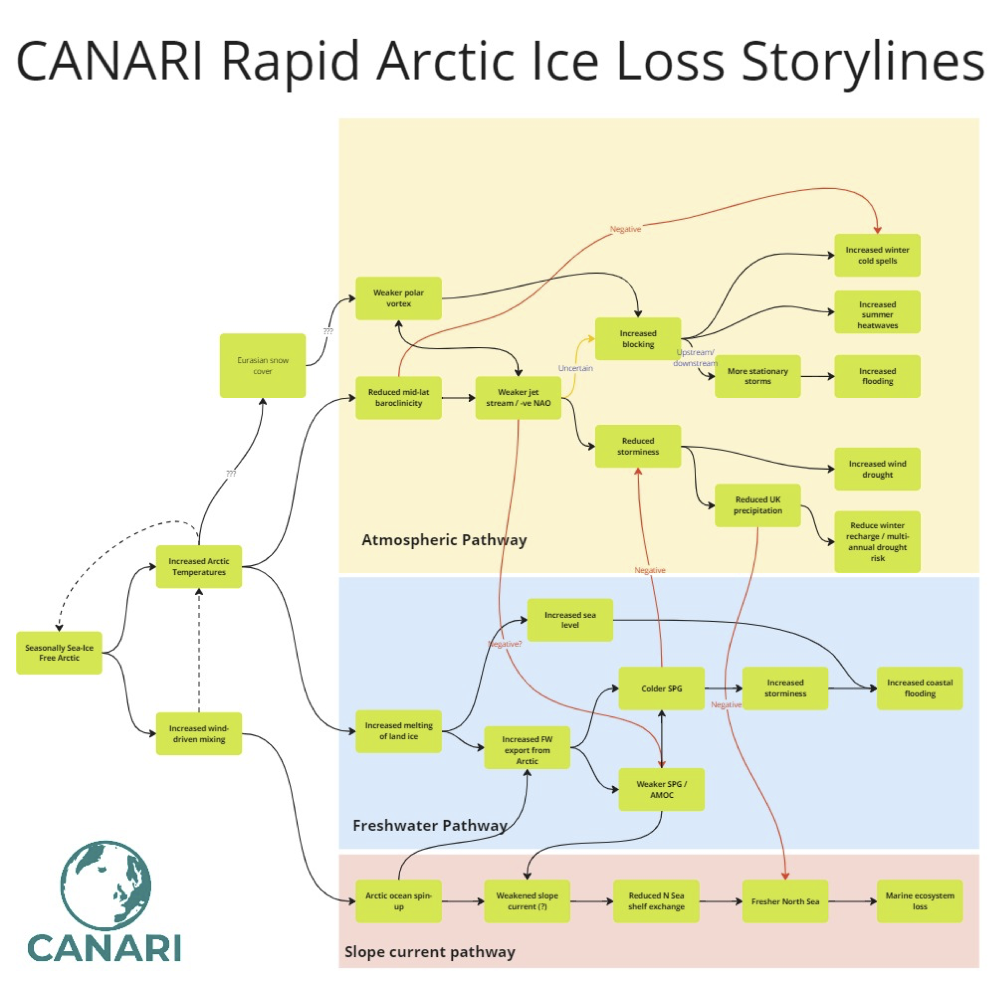

# About 

As part of the [CANARI project](https://canari.ac.uk/) (Climate change in the Arctic – North Atlantic region and impacts on the UK) a large ensemble of the HadGEM3 coupled climate model is being run, [CANARI-LE](https://canari.ac.uk/resources_new/tools/).  Following the success of the data analysis sprint in March 2024 a data has been set for a second sprint, the week of January 27-31, 2025.  This page is designed to provide details of the ensemble, information about the [data and how to access it](data.md), [pre-event requirements](setup.md), [sprint](sprint.md), [tutorials](tutorials.md) and [frequently asked questions](FAQ.md).  Highlights from the previous can current sprints can be found on the [highlights](highlights.md) page. 

The figure above shows the 2023 JJAS anomalously warm Sea Surface temperatures from observation based data (left) and the best analog from the CANARI-LE.  (Courtesy of Reinhard Schiemann)

## Ensemble Selection

!!!! YOUR OCEAN MODEL NEEDS YOU !!!!!

We will shortly be deciding which LEs to force our new ocean model configurations with. We want to select wisely, based on having looked at how the LE ice, ocean and atmosphere fields evolve in the future.

 
Good work has already started on calculating useful ice (e.g. sea ice extent), ocean (AMOC, OHC, transports) and atmosphere (NAO, AO) indices over the historical period, but we need some insight into the future. This Sprint is an opportunity to bring this together, coherently across the project and produce sets of summary figures (e.g. Taylor diagrams) that will inform our choice.
 
Tune in Monday afternoon to find out whether you are already planning on analysis that is useful.

## Storylines

Tune in Monday afternoon to join in the discussion.

## Publications

Soon :)

