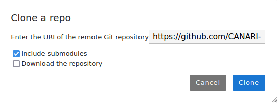
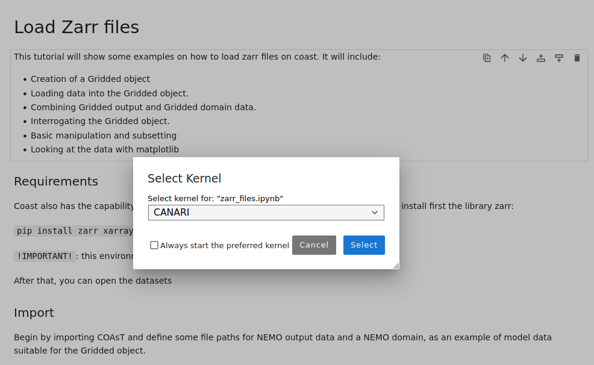

# Tutorials

Some simple python tutorials to get you started analysing the CANARI-LE on JASMIN.

## Tutorial 1 - Configuring and Using the JASMIN Notebooks Service

### Logging into the JASMIN Notebook Service

1. In your web browser visit [https://notebooks.jasmin.ac.uk](https://notebooks.jasmin.ac.uk)
2. Login using your JASMIN username and password
3. You will then be emailed a one time code, paste this into the verification code box.
4. A Jupyter notebook interface will now be started and you can create a new notebook or open a terminal.
   
Your JASMIN home directory and group workspaces will be accessible from within the notebook environment.

### Setting up the CANARI Conda Environment
We have preconfigured a CANARI conda environment for you to use. This contains many (but perhaps not all) of the packages you are likely to need. It is built using the environment.yml file that can be found in the [CANARI tutorials github](https://github.com/CANARI-sprint/tutorials/blob/main/environment.yml). The environment is located on the Group Work Space under the path `/gws/smf/j04/canari/conda-env`, because it is held in a non-standard location your Jupyter notebooks won't find it automatically. In order to use it do the following:
* From the Jupyter launcher click on the terminal icon
* Type: `conda run -p /gws/smf/j04/canari/conda-env -m ipykernel install --user --name CANARI` and press enter
* Open a new Jupyter launcher by clicking on File and then New Launcher
* There should now be a notebook and console option called CANARI. 

### Getting the CANARI example code
1. Click on the Git menu and choose "Clone a repo" 
2. Enter https://github.com/CANARI-sprint/tutorials as the URI of the remote Git repository. 
3. Click Clone

This will create a copy of the repository from https://github.com/CANARI-sprint/tutorials into your JASMIN home directory.

### Open and run an example notebook
1. Click on the tutorials folder that contains your clone of the github repository. 
2. Open the notebooks folder and then the general folder.
3. Choose the zarr_files.ipynb notebook 
4. If you are asked which kernel you would like to use choose the CANARI kernel. 
5. Test the notebook can run by clicking on the Run menu and choosing "Run all cells" or going through each cell one by one and clicking the play button. 

